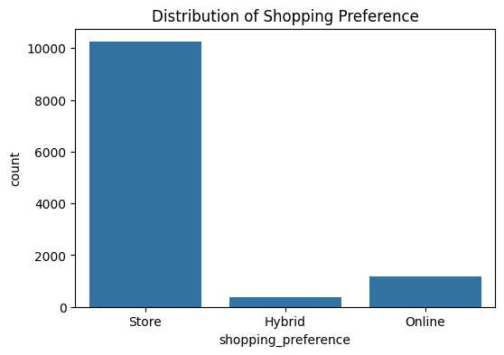
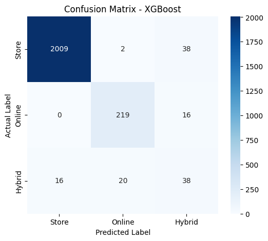

# 🛒 Smart Sales Channel Prediction: Multi-Class Classification with XGBoost

# 🎯 Business Overview

In the modern retail ecosystem, understanding whether customers prefer **Online**, **Offline**, or **Hybrid** shopping channels is essential for improving marketing efficiency and customer engagement. This project builds a **multi-class classification model** to predict customer shopping channel preferences using digital behavior data and demographic characteristics.

With this model, retail companies can:

- Optimize marketing strategies based on customer preferences  
- Allocate promotions more effectively between online and offline channels  
- Better understand customer behavior in an **omnichannel retail ecosystem**

# 📊 Dataset

**Dataset source:**  
https://www.kaggle.com/datasets/shree0910/online-vs-in-store-shopping-behaviour-dataset

The target variable in this project is:
**shopping_preference**

- **Store** → customers primarily shop in physical stores  
- **Online** → customers primarily shop through online platforms  
- **Hybrid** → customers use both online and offline shopping channels  

The dataset contains **11,789 customers** with multiple features describing shopping behavior, digital activity, and product interaction preferences.

## Label Distribution

The label distribution shows that the **Store class dominates the dataset**, compared to **Online** and **Hybrid** classes. This imbalance presents a challenge during modeling because the algorithm may become biased toward the majority class.

# 🤖 Machine Learning Model

The model used in this project is **XGBoost Classifier**, a **Gradient Boosting-based algorithm** well known for its strong performance in classification tasks.

### Modeling Strategy

- **Primary Algorithm:** XGBoost Classifier  
- **Imbalanced Data Handling:** `compute_class_weight`  
- **Hyperparameter Optimization:** `RandomizedSearchCV`  
- **Main Evaluation Metric:** **F1-Score**

This approach ensures that the model not only achieves high accuracy but also performs well across imbalanced classes.

# 📊 Model Evaluation

Model performance was evaluated using a **classification report** and **confusion matrix**.

**Model Accuracy 96%**

## Classification Report

| Class | Precision | Recall | F1-score |
|------|------|------|------|
| Store | 0.99 | 0.98 | 0.99 |
| Online | 0.91 | 0.93 | 0.92 |
| Hybrid | 0.41 | 0.51 | 0.46 |

### Model Performance Analysis

- The model performs **extremely well in predicting Store and Online classes**.
- Performance on the **Hybrid class is lower**, likely because Hybrid customers exhibit mixed behavior between online and in-store shopping.
- The **Weighted F1-score of 0.96** indicates strong overall classification performance.

# 🧠 Analysis & Insights

Based on the modeling results and feature interpretation using **SHAP (SHapley Additive exPlanations)**, several key insights were identified.

### 1. Digital Maturity

Features such as `tech_savvy_score` and `daily_internet_hours` are among the strongest predictors of customer shopping preferences.

Customers with low technological familiarity are rarely predicted as **Online shoppers**.

### 2. Hybrid Behavior Pattern

Customers in the **Hybrid** category are highly sensitive to `shipping_cost_sensitivity`.

- When shipping costs increase → customers tend to switch to **Offline shopping**
- When discounts are offered → customers remain **Online shoppers**

This suggests that Hybrid customers are highly responsive to promotional strategies.

### 3. Income Influence

The feature `monthly_income` indicates that customers with higher income levels are more likely to become **Hybrid shoppers**.

This reflects a flexible lifestyle that balances the convenience of online shopping with the experience of visiting physical stores.

### 4. Probabilistic Threshold

Probability distribution analysis shows that the **Hybrid class has a thinner classification boundary** compared to the other classes.

As a result, Hybrid customers require more targeted marketing strategies to convert them into **Online-first customers**.
